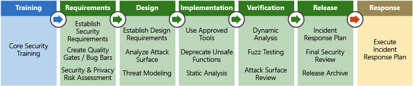

# Security Architecture

[TOC]

**Assume breach** and adopt a **Zero Trust** model. This is the 'security pillar' of the Azure Well-Architected Framework.

Security layers are as follows:

* **Physical Security** - controlled by Azure
* **Identity & Access (IAM)** - MFA, audit events and changes
* **Perimeter** - firewalls, DDoS protection
* **Network** - traffic isolation, deny by default, secure connectivity to on-prem
* **Compute** - Secure access to virtual machines, AV/endpoint protection, Patch management
* **Application** - should be free of vulnerabilities, store app secrets in a secure medium, have security baked in rather than bolted on
* **Data**

The data is what most attackers are after. 

| #    | Ring              | Example                                         | Principle       |
| ---- | ----------------- | ----------------------------------------------- | --------------- |
| 1    | Data              | Data encryption at rest in Azure blob storage   | Integrity       |
| 2    | Application       | SSL/TLS encrypted sessions                      | Integrity       |
| 3    | Compute           | Regularly apply OS and layered software patches | Availability    |
| 4    | Network           | Network security rules                          | Confidentiality |
| 5    | Perimeter         | DDoS protection                                 | Availability    |
| 6    | Identity & Access | Azure Active Directory user authentication      | Integrity       |
| 7    | Physical Security | Azure data centre biometric access controls     | Confidentiality |

### Identity Management

Use **Azure AD** (SSO + 2FA). **Azure AD Connect** integrates Azure AD with your on-prem Active Directory. **Azure AD Application Proxy** can allow legacy applications to be secured this way as well.

**Azure AD Privileged Identity Management (PIM)** provides oversight of role assignments, self-service, JIT role activation, and Azure resource access reviews. This requires Azure AD Premium P2 or Enterprise Mobility + Security (EMS) E5.

#### Service Principals

An *identity* is any thing that can be authenticated. A *principal* is an identity acting with certain roles or claims, like sudo. This can be used to constrain the access scripts have.

#### Managed Identities

Service principles can be tedious to create and manage. Managed identities are easier and do most of the work for you. When you create a managed identity for a service you are creating an account on the Azure AD tenant. You can then use that account like any other, including securely letting the authenticated service access other Azure resources.

### Perimeter

WAFs in Azure are configured with OWASP 3.0 or 2.2.9 rules sets. For non-HTTP-based services **network virtual appliances (NVA)** can be configured. 

Virtual network security can be achieved with Network Security Groups. To isolate Azure services to a virtual network, use a virtual network with service endpoints. 

**ExpressRoute** is a service providing a virtual circuit that doesn't travel over the internet, directly from a corporate network into Azure. Probably an MPLS connection.

### Application Security

Use Azure Security Centre to analyse application logs and alert. 

### Data

#### Encryption

**Azure Storage Service Encryption (SSE)** uses AES 256 and encrypts data before persisting it to disk. This is transparent to services using the data. You can bring your own keys or use Microsoft-managed ones. SSE is usable in Azure Managed Disks, Blob Storage, Azure Files, Queue Storage and Table Storage.

**Azure Disk Encryption (ADE)** is a similar service for IAAS virtual machine disks. It uses Bitlocker on Windows and DM-Crypt on Linux. This is integrated with Azure Key Vault for key storage - you can use a Managed Identity for Azure services accessing the key vault.