# AZ-500

[TOC]


# Top 5 items before pushing to production
## 1. Azure Security Centre
ASC provides the following:
* Security recommendations based  on config, resources and networks
* Monitor security settings across on-prem and cloud, and apply required security to new resources
* Monitor services and perform vulnerability assessments
* Use machine learning to detect and block malware from being installed in your services and virtual machines. Also supports an **allow list**.
* Analyse and identify inbound attacks, help investigate threats post-breach
* JIT access control for ports


## 2. Inputs & Outputs

* Always use an 'allow list' for input, and verify server-side
* Parameterize queries to protect against SQLi
* Encode output to protect against XSS


## 3. Secrets in Key Vault

Azure Key vault is a secret store designed to store configuration secrets for server applications. It is not designed for storing data belonging to your app's users. It can be accessed via REST API or a client SDK. Key vault allows users to store connection strings, secrets, passwords, certificates, access policies, file locks (making items in Azure read-only) and automation scripts. It logs access and activity, allowing you to monitor access control. It has diagnostics, metrics and alerts.


## 4. Framework Updates

Choose a modern framework, and keep it up to date. Use the security features the framework provides, and never roll your own security.


## 5. Safe Dependencies

Track your application dependencies for vulnerabilities. Use Snyk, Retire.js, and static code analysis.

-----------------------


# Create Security Baselines

Azure security baselines are based on CIS (Centre for Internet Security), which has two implementation levels:

1. **Level 1** - recommended minimum settings, which should not reduce functionality
2. **Level 2** - recommendations for highly secure environments, with functionality reduced.


## IAM recommendations

### Restrict access to the Azure AD administration portal (Level 1)

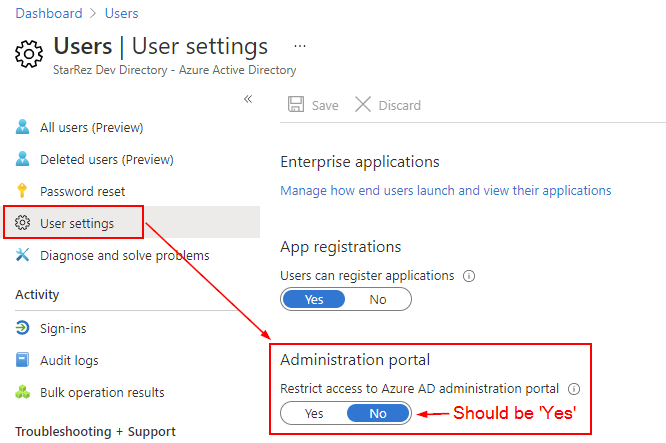

This stops all non-administrators from accessing any Azure AD data in the admin portal, but does not restrict access using PowerShell or Visual Studio.


### Application Options - Allow users to register apps (Level 2)

Only administrators should be able to register custom applications.

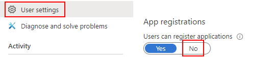


### Enable Azure AD MFA (Level 2)

Go to the Multi-Factor authentication page:

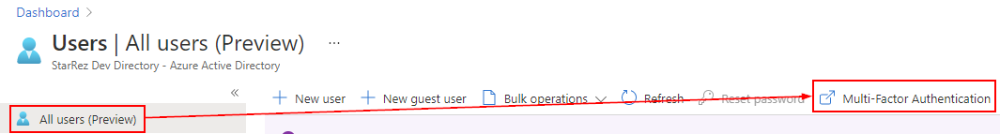

Ensure that MFA is enabled for all users who are co-Administrators, Owners or Contributors.

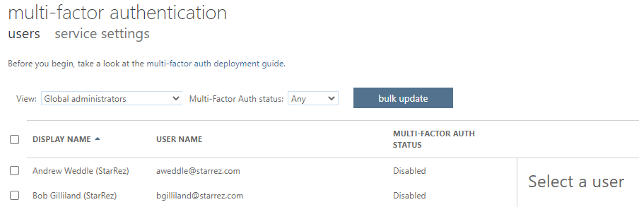


### Block remembering MFA on trusted devices (Level 2)

Remembering MFA reduces the amount of prompts by keeping the user signed-in for a number of days on a trusted device. This can be a security issue if the device or account is compromised. This setting can be turned off in the MFA page: 

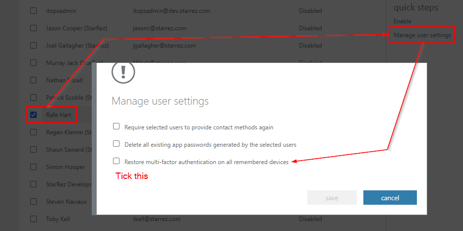


### Don't allow Guests (Level 1)

Ensure that no guest users exists (`USER TYPE=Guest`):

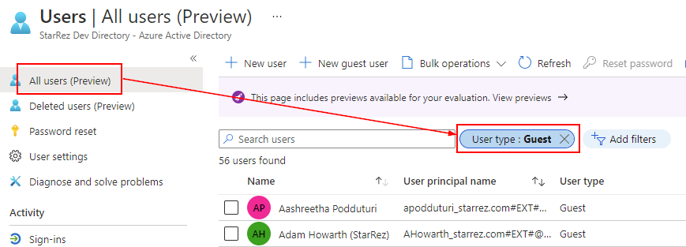

If the business requires guests, ensure their permissions are limited.


### Password Options (Level 1-2)

* Notify users on password resets (Level 1)
* Notify all admins when other admins reset passwords (Level 2)

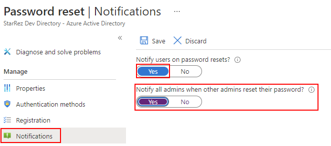

* Require two methods to reset passwords (Level 1)

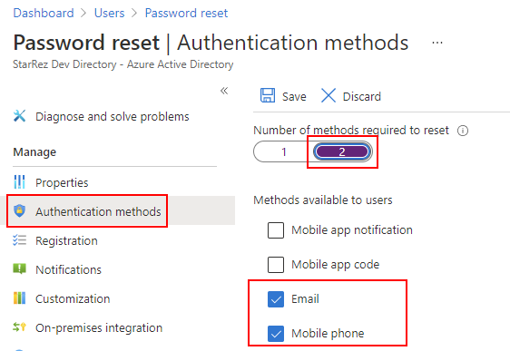


### Establish reconfirm user auth methods (Level 1)

Users should be prompted to reconfirm their authentication information. The default is every 180 days.

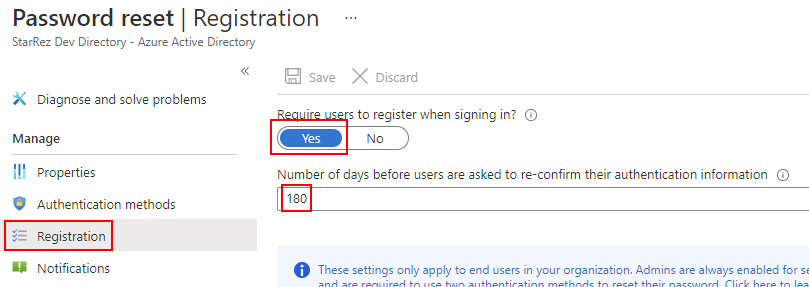


### Members and guests can invite (Level 2)

Only administrator should be able to invite people to work in the tenant. This can be set under **Users > User Settings > External Users**: 

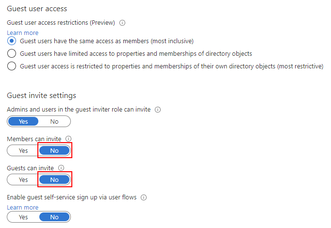


### Users to create and manage security groups (Level 2)

The creations of new security groups should be limited to administrators. This is found under **Groups > General**.

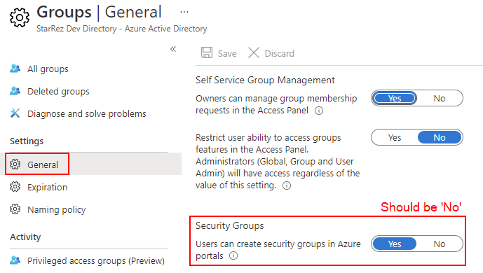


### Self-service group management enabled (Level 2)

The Azure CIS benchmark recommends disabling control of groups by users until delegation is required:

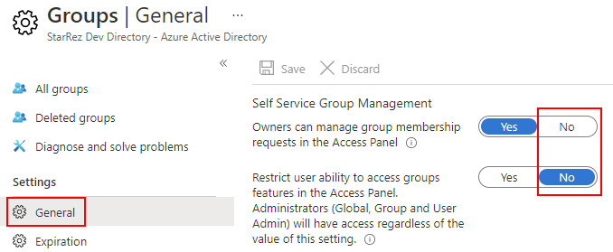


# Create an Azure Security Centre baseline

### Enable Azure Defender in ASC (Level 2)

This used to be the 'standard' plan, as opposed to basic. It will require the ASC Default policies to be rolled out across all subscriptions.

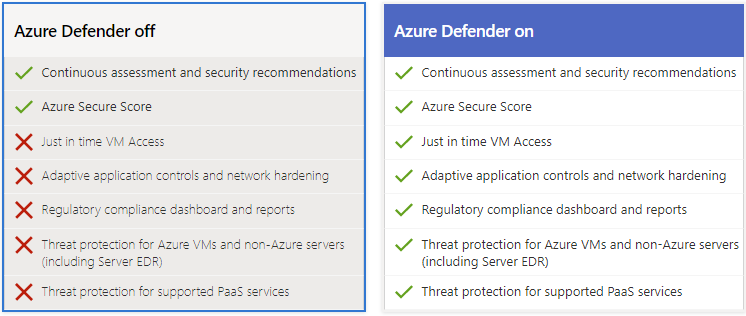


### Enable the automatic provision of a monitoring agent (Level 1)

Agents need to be installed in resources to collect data and provide better alerts and recommendations. This requires Azure Defender to be turned on. In **Security Center > Security Policy > Subscription > Auto-provisioning** this can be enabled:

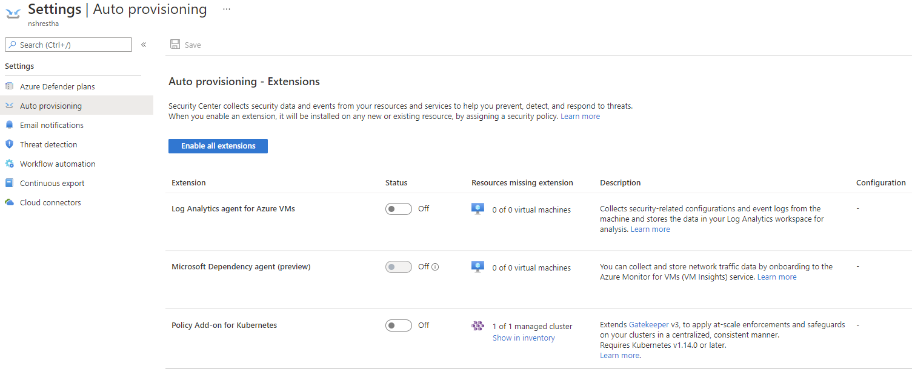


### Enable System Updates (Level 1)

Confirm that **System Updates should be installed on your machines** is one of the policies. Ensure that it is set to **AuditIfNotExists**. This should be the ASC default.


### Enable Security Configurations (Level 1)

Confirm that **Vulnerabilities in security configuration on your virtual machine scale sets should be remediated** is set to **AuditIfNotExists**. This should be the ASC default.


### Other Settings

* **Enable Endpoint Protection (Level 1)** - this requires Azure Defender for VMs
* **Enable Disk Encryption (Level 1)** - this defaults to 'on' for new resources
* **Enable Network Security Groups (Level 1)** - these use Access Control Lists (ACL) rules that allow or deny network traffic to VMs.
* **Enable Web Application Firewall (Level 1)** - who doesn't love a WAF?
* **Enable Vulnerability Assessment (Level 1)** - Requires Azure Defender for VMs
* **Enable Storage Encryption (Level 1)** - default for new resources
* **Enable JIT Network Access (Level 1)** - lock down inbound traffic to VMs
* **Enable Adaptive Application Controls (Level 1)** - this enables intelligent whitelisting controls for VMs
* **Enable SQL Auditing & Threat Detection (Level 1)**
* **Enable SQL Encryption (Level 1)**
* **Set Security Contact Email and Phone Number (Level 1)** - This should be under Cost Management.
* **Enable Sent me emails about alerts (Level 1)** - in Security Centre, Email notifications


## Create a Storage accounts baseline

The following settings should be in place:

* **Require security-enhanced transfers (Level 1)** - requires https. Found under **Storage Account > Configuration**.

* **Enable binary large object (blob) encryption (Level 1)** - default setting

* Periodically regenerate access keys (Level 1) - this can be done manually under **Storage Account > Access Keys**. If you are not using Azure Key Vault with key rotation, this can be done with the following HTTP request:

```http
POST https://management.azure.com/subscriptions/{subscriptionId}/resourceGroups/{resourceGroupName}/providers/Microsoft.Storage/storageAccounts/{accountName}/regenerateKey?api-version=2019-04-01
```

* **Require Shared Access Signature (SAS) token to expire < 1 hour (Level 1)** - this is a URI that grants access to Azure storage resources. This is under **Storage Account > Shared Access Signature**.
* **Enable Azure Files encryption (Level 1)** - default setting
* Require only private access to blob containers (Level 1) - Go to **Storage Account > Blob Service > Containers** and confirm that Public Access Level is Private.


## Create an Azure SQL Database baseline

The following settings should be in place:

* **Enable Auditing (Level 1)** - set under **SQL Database > Auditing**. Storage blob, log analytics or Event Hub. A secondary requirement is that audit retention should be set to greater than 90 days.
* **Enable a threat detection service (Level 1)** - enable Azure Defender under **SQL Server > Security Center**. Then turn on all threat detection types (vulnerability assessment & data classification).
* Enable the option to send security alerts (Level 1) - Under **SQL Databases > Auditing & Threat Detection > Database Settings > View Advanced Data Security server settings** and ensure that Send alerts is set as appropriate.
* **Enable the email service and co-administrators (Level 1)** - under **SQL databases > Advanced Data Security** and tick 'Email service and co-administrators'


## Create a logging & monitoring baseline

An Azure activity log is a subscription log that provides insight into subscription-level events that have occurred in Azure. Using the activity log, you can determine the what, the who, and the when for any write operations taken on the resources in your subscription.

The following settings should be in place:

* **Ensure that a log profile exists (Level 1)** - Monitor needs to store information somewhere. This is configured via Diagnostic Settings.
  
  * Retention should be set to 365 days or more (Level 1)
* **Create an activity log alert for "Creating a policy assignment (Level 1)"** Go to **Monitor > Alerts > New alert rule**. Select Resource > Policy (from Filter by resource type) > Done. This helps identify who has that privilege and can help detect a breach or misconfiguration.
* **Create an activity log alert for "Creating, updating, or deleting a Network Security Group" (Level 1)** - as above
* **Create an activity log alerts for "Creating or updating an SQL Server firewall rule" (Level 1)** - as above


## Create a Networking baseline

